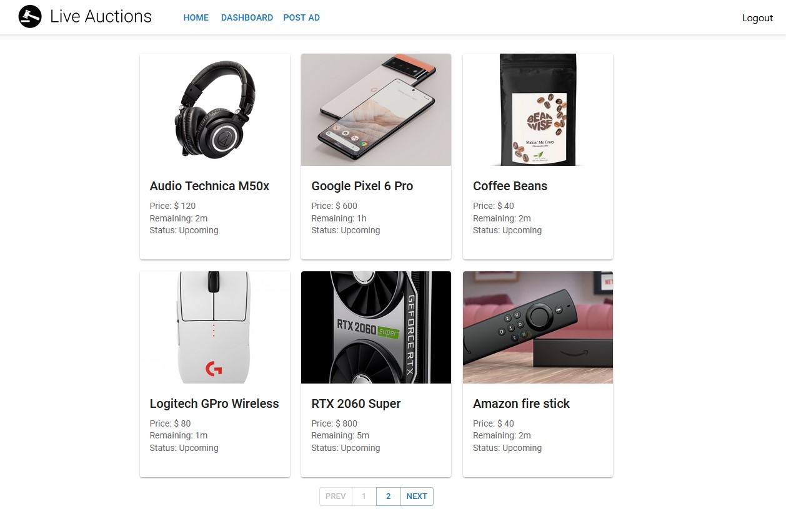
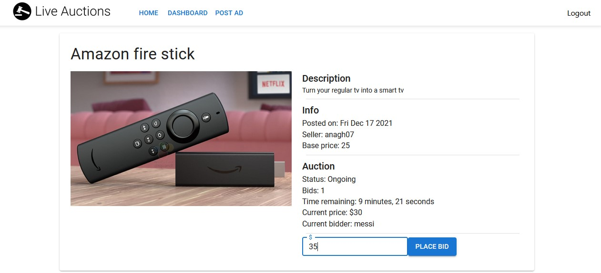

# About
Website where products can be purchased and sold via live auctions. \
Sellers can upload product image along with information and setup an auction (duration, starting price). \
Potential buyers can find the advertisements and bid on them. Auction pages have live notification and synchronization features, meaning that once a bid is place by one user, other users who are on the same page will receive the updates without having to refresh the page. \
Users also receive a notification once an auction starts/ends.

### Links
- <a href="https://live-auctions.netlify.app/"><strong>live website</strong></a>
- <a href="https://youtu.be/8IAzQQJ47to"><strong>demo video</strong></a>
   
   

# Description
## Feature highlights:
- Authentication: Login-logout
- Authentication: Signup
- Post ads along with image-upload
- Landing page with ad cards and pagination
- Live auction features
- Users' history of purchased products and posted ads
- Notification when new ads are posted

## Language, Frameworks and Libraries
Backed (REST API):
- Node.js
- Express
- Javascript

Frontend (Web application):
- React JS
- Redux (State management)
- Material UI (Theme and ui components)

Database:
- Mongodb

Storage:
- AWS S3 Bucket

Hosting:
- Heroku (server)
- Netlify (client)

## Screenshots:

  

 

  

# Notes on using the website
Project is hosted <a href="https://live-auctions.netlify.app/"><strong>here</strong></a>
- If you do not want to register, press the skip button during login. This will log you in as a test user (test@test.com).
